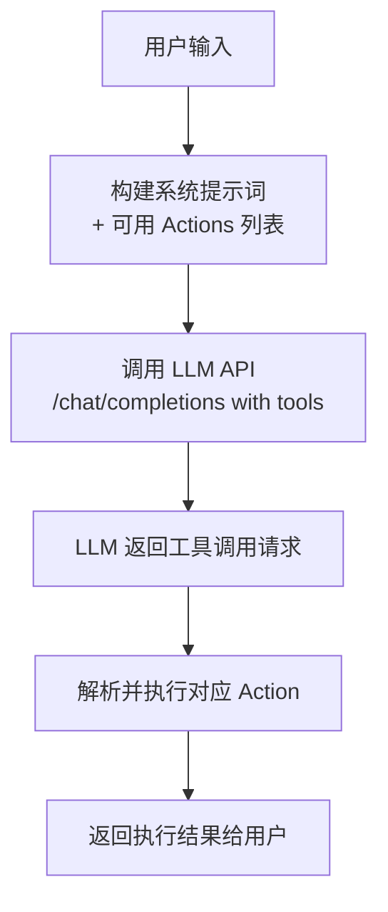

## 用户需求分析

用户要求正确集成真正的 LLM 功能到 Page Agent 中。当前实现只是简单的关键词匹配（if-else 硬编码），没有真正调用 LLM API，导致配置的自定义端点无法使用。

### 核心问题

1. 当前 `handleIntent` 函数使用硬编码关键词匹配，未调用 LLM
2. 虽然配置系统完整（provider、apiKey、baseUrl、model），但 LLM API 从未被调用
3. 用户配置了自定义端点，但测试时看不到使用记录

### 目标

实现真正的 LLM 集成，使用 Function Calling（工具调用）模式让 LLM 理解用户意图并执行相应 Action，支持多种 Provider（OpenAI、Claude、DeepSeek、自定义等）。

## 技术方案

### 架构设计

采用 **Function Calling（工具调用）** 模式，这是现代 LLM Agent 的标准做法：



### 实现策略

1. **LLM 服务层**: 创建统一接口封装不同 Provider 的 API 调用，支持 OpenAI 兼容格式
2. **工具定义**: 将所有 Actions 转换为 LLM 可理解的 Function Schema
3. **对话管理**: 维护对话历史，支持多轮交互
4. **流式响应**: 支持打字机效果，提升用户体验

### 技术选型

- **API 格式**: OpenAI Chat Completions API（最通用的标准）
- **工具调用**: Function Calling / Tools 模式
- **HTTP 客户端**: 原生 fetch，无需额外依赖
- **流式处理**: ReadableStream API 实现打字机效果

### 关键设计决策

1. **统一端点处理**: 不同 Provider 的 baseUrl 自动适配（OpenAI、Claude、DeepSeek、自定义等）
2. **工具描述生成**: 自动从 Action 注册中心生成 Function Schema
3. **错误处理**: 区分网络错误、API 错误、解析错误，提供友好提示
4. **降级机制**: LLM 不可用时优雅降级到本地处理

## 目录结构变更

```
src/pageAgent/
├── components/
│   └── PageAgentWidget.vue    [MODIFY] 替换硬编码 handleIntent，集成 LLM 调用
├── services/
│   └── llmService.ts          [NEW] LLM API 服务，封装多 Provider 调用
├── types/
│   └── llm.ts                 [NEW] LLM 相关类型定义
├── actions.ts                 [EXIST] 已有 Action 系统
├── context.ts                 [EXIST] 上下文和提示词
└── index.ts                   [EXIST] 入口

src/types/pageAgent.ts         [EXIST] 已有类型定义
src/stores/pageAgent.ts        [EXIST] 状态管理
```

### 关键模块说明

#### llmService.ts [NEW]

- `callLLMWithTools()`: 调用 LLM 并传入可用工具列表
- `buildFunctionSchema()`: 将 Actions 转换为 OpenAI Function Schema
- 支持多种 Provider 的 URL 自动适配
- 支持流式和非流式两种模式

#### PageAgentWidget.vue [MODIFY]

- 移除硬编码的 `handleIntent` 函数
- 添加 `processWithLLM()`: 构建提示词并调用 LLM
- 添加 `executeToolCalls()`: 解析 LLM 的工具调用请求并执行
- 维护对话历史 `messageHistory`

#### types/llm.ts [NEW]

- 定义 LLM 请求/响应类型
- 定义工具调用相关类型
- 定义流式响应处理类型